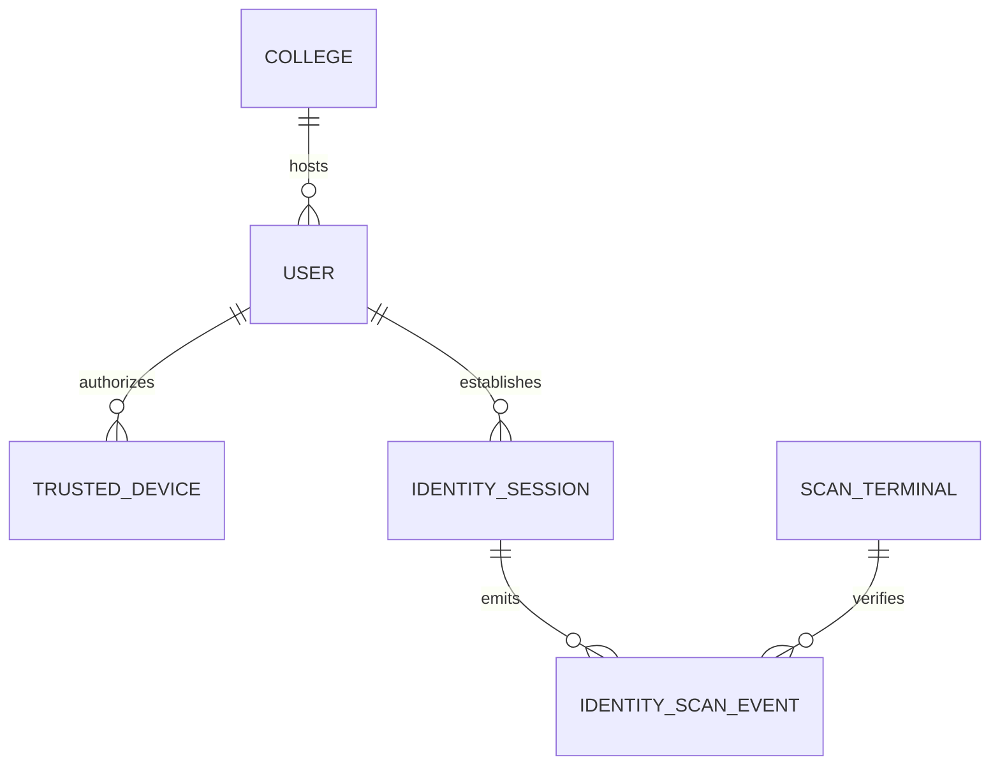
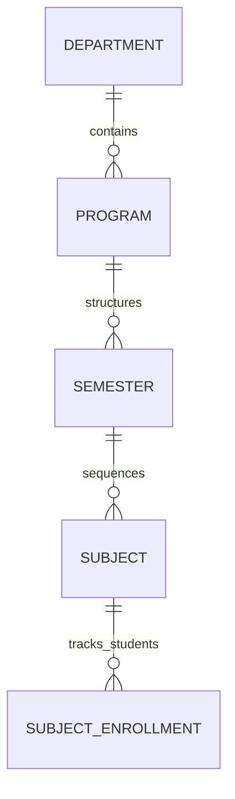
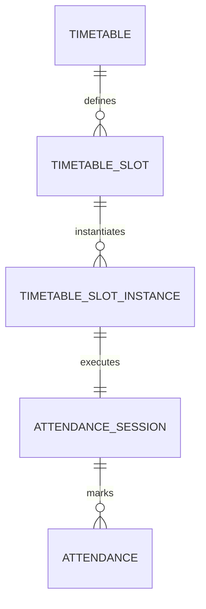

# 📐 Hiveflux: Data Architecture Blueprint
### Deterministic Schema & Institutional Relationships

This document defines the high-fidelity data structures that power the **Hiveflux**. It provides a granular view of the models, their relationships, and the operational logic that ensures data integrity across the platform.

---

## 🛡️ 1. Identity & Governance Domain
The system's security pivot is built on a non-repudiable identity chain, linking users to physical devices and verified scan events.

### Core Entities
- **User (AbstractUser)**: Extended UUID-based identity with multi-college scoping.
- **College (Core)**: The top-level multi-tenant container. All data is scoped to a `college_id`.
- **TrustedDevice**: Fingerprinted hardware profiles (DeviceID, Platform, BrowserSignature).
- **IdentitySession**: A high-fidelity pairing of a User and a Trusted Device with a dynamic `trust_score`.
- **ScanTerminal**: Physical checkpoints (Gates, Labs, Classrooms) with specific security tiers.
- **IdentityScanEvent**: A non-volatile audit log of every presence signal (Check-in, Classroom Entry).

---

## 📅 2. Academic Orchestration Domain
The blueprint of institutional knowledge, mapping academic hierarchies to temporal sequences.

### Core Entities
- **Department**: Organizational units (e.g., Computer Science, Engineering).
- **Program**: Specific courses of study (e.g., B.Tech, MBA).
- **Semester**: Temporal segments of a program (Sequenced 1 through 8).
- **Subject**: Individual knowledge modules with Credit weights.
- **SubjectEnrollment**: Mapping students to specific subjects per semester.

---

## 🚀 3. Operational Execution Domain
The engine that transforms static timetables into real-time session telemetry.

### Core Entities
- **Room**: Physical or virtual spaces with Capacity and GPS coordinates.
- **SubjectAssignment**: The contract linking a Faculty member to a Subject for a specific Semester.
- **Timetable**: The master blueprint for a Section/Semester/Batch.
- **TimetableSlot**: Individual time-space allocations (Day, Time, Room, Faculty).
- **TimetableSlotInstance**: Realized daily instances of a slot (e.g., "DBMS on May 10th").
- **AttendanceSession**: The "Live" state of a class, tracking real-time presence.
- **Attendance**: Individual presence records (Present, Absent, Late).

---

## 💰 4. Financial Integrity Domain
A dual-ledger system governing institutional revenue (Student Fees) and expenditure (Faculty Payroll).

### Revenue Entities
- **FeeStructure**: Programmable fee templates per Program/Semester.
- **Invoice**: Deterministic financial obligations for students.
- **Payment**: Verified transaction records linked to invoices.

### Expenditure Entities
- **SalaryProfile**: Faculty compensation configurations (Base, Tax Regime).
- **SalaryComponent**: Reusable allowance/deduction definitions (HRA, PF, TDS).
- **Payroll**: Monthly compensation records with a frozen audit breakdown.
- **PayrollRunBatch**: High-velocity batch processing logs for institutional salary runs.

---

## 🧠 5. Intelligence & Success Domain
The telemetry bus that calculates proactive signals and manages interventions.

### Core Entities
- **StudentOperationalEvent**: Raw telemetry log of all student actions.
- **SuccessSignal**: Derived intelligence (e.g., "Attendance Decay", "Engagement Spike").
- **SupportRelationship**: Mapping the mentor-student support graph.
- **SystemRecommendation**: AI-driven nudges for academic recovery.
- **SkillMastery**: Tracking student competency levels across their academic journey.

---

## 📊 6. Core System Tables (Foundational)
- **BaseModel**: Provides UUID4 primary keys, `created_at`, `updated_at`, and `is_deleted` (Soft Delete) for all entities.
- **College**: Multi-tenancy anchor with institutional metadata.
- **Address**: Unified polymorphic address storage for users.
- **OperationsActivityLog**: High-level audit trail for administrative actions.
