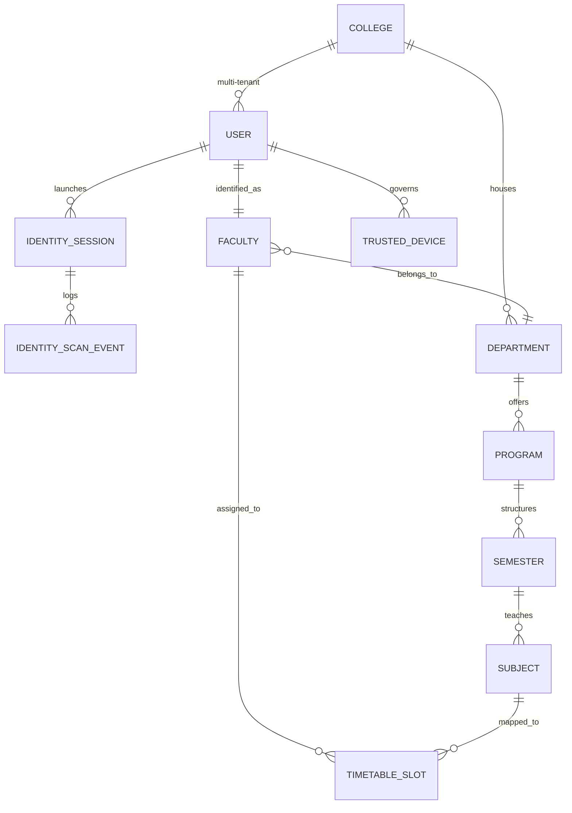

# Hiveflux: Institutional Database Schema
### High-Fidelity Multi-Tenant Infrastructure

This schema defines the relational foundation of the Hiveflux. It is built for **Operational Traceability**, **Identity Integrity**, and **Institutional Scale**.

---

## 🏛️ Enterprise Core (Foundation)
All institutional entities inherit from `BaseModel`.
- **Primary Keys**: `UUID4` for distributed consistency.
- **Audit Trails**: Automated `created_at`, `updated_at`, and `created_by` tracking.
- **Logical Resilience**: soft-delete architecture via `is_deleted`.

### 1. `College` (The Tenant)
| Field | Type | Description |
| :--- | :--- | :--- |
| `id` | UUID | Institutional Identifier |
| `name` | String | Official Institution Name |
| `code` | String | Unique Campus Code |

---

## 🛡️ Identity & Presence OS (Security Layer)
The core security layer managing institutional movement and access governance.

### 2. `User` (Authentication Anchor)
- **Role**: Custom `AbstractUser` with multi-tenant scoping.
- **Governance**: Every user is mapped to a specific `College`.

### 3. `IdentitySession` (Presence Tracking)
Represents a verified presence window for a user.
- **Fields**: `start_time`, `end_time`, `status` (ACTIVE, EXPIRED), `trust_score`.
- **Relations**: Linked to `User` and `College`.

### 4. `IdentityScanEvent` (Audit Logs)
High-fidelity telemetry logs for identity verification.
- **Fields**: `event_type` (GATE_IN, SESSION_START), `timestamp`, `terminal_metadata`.
- **Relations**: Linked to `IdentitySession`.

### 5. `TrustedDevice` (Access Governance)
Manages the hardware trust layer for each user.
- **Fields**: `device_name`, `device_id`, `trust_level`, `last_verified`.
- **Relations**: Linked to `User`.

---

## 👔 Faculty Operations Module
Manages staff as operational entities with quantified reputation.

### 6. `Faculty` (The Entity)
- **Fields**: `designation`, `specialization`, `bio`, `reputation_score`.
- **Reputation Layer**: Stores calculated punctuality and presence metrics.
- **Relations**: `User`, `Department`, `College`.

---

## 🎓 Academic Execution Engine
Hierarchical governance of institutional knowledge.

### 7. `Department` → `Program` → `Semester` → `Subject`
- **Department**: Organizational unit (e.g., "Engineering").
- **Program**: Specific degree (e.g., "B.Tech CSE").
- **Semester**: Academic term mapping.
- **Subject**: Specific course with workload definitions.

### 8. `TimetableSlot` (Operational Grid)
- **Fields**: `day`, `start_time`, `end_time`, `room`.
- **Relations**: `Subject`, `Faculty`, `Semester`.

---

## 💰 Institutional Finance & Payroll
Precision tracking of institutional capital and compensation.

### 9. `FeeStructure` & `Invoice`
- **Mapping**: Fees are mapped to `Program` + `Semester` combinations.
- **Invoicing**: Deterministic invoice generation with soft-mapping for scholarships.

### 10. `SalaryArchitecture`
- **SalaryProfile**: Individual mapping of `SalaryComponents` to a `Faculty` entity.
- **PayrollBatch**: Monthly snapshots of institutional payout liability.

---

## 📢 Intelligence & Communication
- **Notification**: Real-time operational alerts with priority levels.
- **Notice Center**: Broadcasts with multi-dimensional targeting (Roles, Departments, Semesters).

---

## 🗺️ Entity Relationship Summary (Mermaid)

