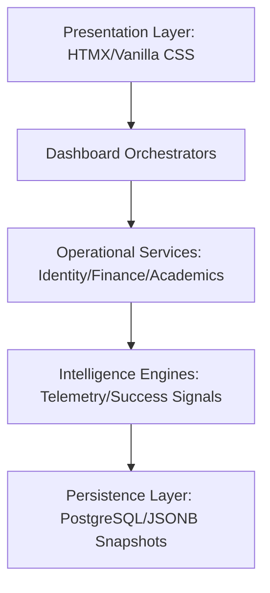

# 📄 SRS Documentation: Hiveflux (ERP_college management system)
## Software Requirements Specification for Institutional Orchestration

**Project Name**: Hiveflux 
**Version**: 1.0.0-Gold 
**Domain**: Institutional ERP, LMS, and Student Success SaaS  
**Architecture**: Monolithic Core with Asynchronous Telemetry & HTMX Frontend  

---

## 1. Introduction

### 1.1 Purpose
The **Execution OS** is designed to transform traditional, static college management into a real-time, data-driven orchestration environment. It focuses on non-repudiable identity, surgical academic execution, and proactive student success intelligence.

### 1.2 Institutional Problem Landscape
Traditional ERP systems fail in higher education due to:
- **Disconnected Workflows**: Data silos between academics, finance, and attendance.
- **Lack of Telemetry**: Systems track *what happened* (historical) but not *what is happening* (real-time).
- **Reactive Governance**: Interventions only occur after failure (e.g., failing grades) rather than during the decay phase.
- **No Predictive Infrastructure**: Lack of signals to identify at-risk behavior before it crystalizes into academic loss.

### 1.3 Strategic Differentiators
| Feature | Traditional ERP | Execution OS |
| :--- | :--- | :--- |
| **Workflow Logic** | Static CRUD | Dynamic Orchestration |
| **Attendance** | Manual Tracking | Presence Intelligence |
| **Financials** | Record Keeping | Governance & Integrity |
| **Timetable** | Static Storage | Operational Execution |
| **Governance** | Reactive | Predictive (Telemetry-First) |

---

## 2. Technology & Infrastructure

### 2.1 Technical Rationale
- **Django 6.0.4**: Selected for institutional-grade security, rapid development, and a robust ORM that handles complex relational mapping.
- **HTMX 1.9.11**: Chosen to preserve server-side state control while delivering high-density, low-latency operational interfaces without the overhead of heavy SPA frameworks.
- **Django Channels (Daphne)**: Used for real-time telemetry synchronization and future live orchestration layers, enabling the system to react to events as they occur.
- **PostgreSQL Ready**: Engineered for row-level scalability, JSONB support for telemetry snapshots, and future database partitioning.

### 2.2 Infrastructure Architecture
The system utilizes a multi-layered infrastructure to ensure operational deterministic behavior:
- **Redis Cache**: Used for high-speed snapshot caching and WebSocket message brokering.
- **Asynchronous Queues**: Celery/Redis for non-blocking task execution (Payroll runs, notification batching).
- **Telemetry Bus**: An internal event dispatcher that routes operational signals to intelligence engines.
- **Adaptive Visual Engine**: A frontend layer that adjusts rendering density based on device performance (Low-Fidelity mode).

---

## 3. System Architecture & State Models

### 3.1 Layered Architecture

### 3.2 Operational State Machines
The system behavior is governed by deterministic state transitions:

**Attendance Session Lifecycle:**
- `READY` → `LIVE` (Triggered by schedule/manual)
- `LIVE` → `PAUSED` (Administrative hold)
- `LIVE` → `COMPLETED` (Audit lock engaged)

**Student Success State:**
- `ONBOARDING` → `ACTIVE`
- `ACTIVE` → `AT_RISK` (Triggered by Telemetry Decay)
- `AT_RISK` → `RECOVERING` (Active Intervention)
- `RECOVERING` → `ACTIVE` / `ACADEMIC_WARNING`

---

## 4. Functional Requirements

### 4.1 Identity & Security (ID-100)
- **FR-101**: The system shall bind authenticated identity sessions to a verified trusted device fingerprint.
- **FR-102**: The system shall rotate identity tokens every 60 seconds using a non-repeating nonce logic.
- **FR-103**: The system shall assign a dynamic trust score to every session based on usage continuity and institutional verification history.

### 4.2 Academic Orchestration (AC-200)
- **FR-201**: The system shall realize static `TimetableSlots` into daily `TimetableSlotInstances` 24 hours in advance.
- **FR-202**: The system shall allow drag-and-drop slot reallocation with automatic conflict detection for faculty and room resources.
- **FR-203**: The system shall provide a kinetic "Live Monitor" surface for real-time class tracking.

### 4.3 Financial Integrity (FN-300)
- **FR-301**: The system shall generate immutable audit snapshots of salary components at the time of payroll locking.
- **FR-302**: The system shall enforce unique invoice constraints per student/semester/invoice-type to prevent double-billing.

---

## 5. Operational Intelligence & Telemetry

### 5.1 Telemetry Infrastructure
The system implements an event-driven telemetry bus:
- **Event Capture**: Every scan, grade update, or payment is emitted as a `StudentOperationalEvent`.
- **Signal Derivation**: The engine processes events to generate `SuccessSignals` with specific severity (INFO, WARNING, CRITICAL).
- **Explainability Trace**: Every intelligence decision (e.g., Risk Score change) must generate an `ExplanationTrace` log showing the weighted factors involved.

### 5.2 Intelligence Governance
- **Fatigue Control**: The system shall suppress redundant notifications if signal density exceeds policy thresholds.
- **Confidence Scoring**: Recommendations must carry a confidence percentage derived from telemetry freshness.

---

## 6. Non-Functional Requirements

### 6.1 Scalability & Performance
- **NFR-601**: The system shall support 500+ concurrent telemetry scans per terminal without latency degradation (>200ms).
- **NFR-602**: Database queries for dashboard analytics must be optimized via pre-computed snapshots (`IntelligenceSnapshot`).

### 6.2 Availability & Resilience
- **NFR-602**: **Degraded Mode**: If the intelligence engine is offline, the system shall fallback to cached snapshots while preserving core "Live" operations.
- **NFR-603**: **State Consistency**: All state transitions must be atomic; any failure shall roll back to the previous deterministic state.

### 6.3 Observability
- **NFR-604**: The system shall expose a "Telemetry Health" dashboard for administrators to monitor signal accuracy and orchestration failures.

---

## 7. Security Architecture

### 7.1 Multi-Layered Protection
| Layer | Protection Mechanism |
| :--- | :--- |
| **Identity** | Device Fingerprinting & Trust Scoring |
| **Session** | Rotating UUID Tokens & Nonce Validation |
| **Presence** | Geographic & IP Correlation |
| **Governance** | Scoped Multitenancy (College Anchor) |
| **Finance** | Immutable Audit Snapshots |

### 7.2 Threat Models
- **QR Spoofing**: Mitigated by high-frequency rotation and device binding.
- **Replay Attacks**: Prevented via server-side nonce consumption.
- **Privilege Escalation**: Enforced through Role-Permission mapping with strict ORM scoping.

---

## 8. Integration & API Contracts

### 8.1 HTMX Payload Standards
- All partial renders must return semantic HTML5 with OOB (Out-of-Band) signals for global state updates (e.g., Toast notifications).

### 8.2 WebSocket Events
- `TELEMETRY_SYNC`: Real-time presence updates.
- `SIGNAL_ALERT`: Priority intelligence nudges.
- `STATE_CHANGE`: Synchronizing UI state across multiple administrative terminals.
