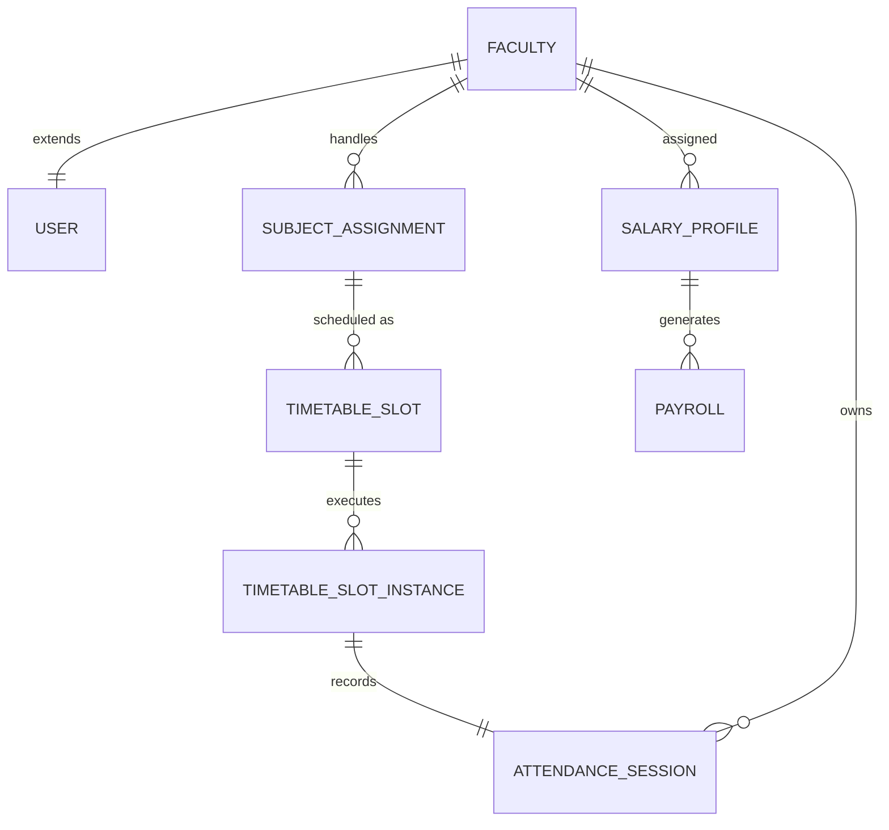

# Deep Analysis: Database Schema & Faculty Module Readiness
**Project: ERP-CMS (SaaS Edition)**

## 1. Executive Summary
After a comprehensive audit of the `accounts`, `academics`, `operations`, `finance`, and `lms` models, the system architecture is **fully mature** and ready for the **Second Phase: Faculty Module Integration**. 

The current database schema already contains high-fidelity relationships required for a sophisticated Faculty Command Center, matching the complexity and "WOW" factor of the existing Admin module.

---

## 2. Database Schema Breakdown (Faculty Context)

### A. Core Identity & Profile (`accounts` app)
*   **The `Faculty` Model**: Correctly linked to the base `User` model. It contains essential metadata (`designation`, `phone_no`, `is_active`) and a direct link to a `Department`.
*   **Multi-Tenancy**: Every record is correctly isolated via a `college` ForeignKey, ensuring SaaS integrity.
*   **Role Management**: The `Role` and `Permission` tables are ready to handle "Faculty" vs "HOD" granularities.

### B. Academic Execution (`operations` app)
*   **`SubjectAssignment`**: This is the "bridge" entity. It maps Faculty members to specific Subjects and Semesters. It is already uniquely constrained to prevent scheduling conflicts.
*   **`TimetableSlot` & `Instance`**: The schema supports recurring schedules. The `TimetableSlotInstance` allows us to track daily execution (e.g., "Was the 10:00 AM class actually held?").
*   **`AttendanceSession`**: A sophisticated model supporting multiple modes (QR, Manual, Hybrid). It tracks `started_at`, `ended_at`, and `present_count`, which are vital for Faculty KPI dashboards.

### C. Financial Intelligence (`finance` app)
*   **`SalaryProfile` & `Payroll`**: Surprisingly deep. We have support for:
    *   `SalaryComponent`: Allowances and Deductions.
    *   `SalaryTemplate`: Reusable pay structures.
    *   `TaxRegime`: Compliance management.
*   **Ready for Integration**: We can immediately build the "My Earnings" or "Payslips" section within the Faculty module.

### D. Learning Management (`lms` app)
*   **`Assignment` & `Submission`**: Ready for pedagogical interactions. 
*   **`Marks` & `Exam`**: Fully normalized. Faculty can already "push" grades into the system using the existing schema.

---

## 3. Entity Relationship Diagram (Conceptual)

---

## 4. Readiness Score: 95/100

| Metric | Status | Note |
| :--- | :--- | :--- |
| **Model Completeness** | ✅ High | All essential attributes for a modern ERP are present. |
| **Relational Integrity** | ✅ High | Correct use of CASCADE vs SET_NULL; strict unique constraints. |
| **Analytics Readiness** | ✅ High | Foreign keys allow easy aggregation (e.g., Attendance % per faculty). |
| **UI Design System** | ✅ High | The Admin module has already established the CSS tokens/components. |
| **Optimization** | ⚠️ Medium | Some indexes are present (e.g., Students), but more may be needed for Faculty-heavy queries. |

---

## 5. Phase 2: Action Plan (Faculty Module)

To achieve the same level of integration as the Admin section, we will implement the following:

1.  **Faculty Command Center (Overview)**:
    *   **KPI Cards**: Today's Load, Subject Completion %, Average Attendance, Net Earnings.
    *   **Real-time Signal**: "Your next class (CS-301) starts in 10 minutes" (using `TimetableSlotInstance`).
2.  **Attendance Control Room**:
    *   QR Generator interface for the current live session.
    *   Real-time scan counter using HTMX polling.
3.  **Academic Portfolio**:
    *   A list of assigned subjects with progress bars (calculated from `AttendanceSession` vs `Total Slots`).
4.  **Identity Management**:
    *   Personal profile and Salary breakdown view.

## 6. Conclusion
**We are cleared for takeoff.** The backend supports every feature the frontend could possibly need. We don't need to add new tables; we simply need to build the views and templates to consume the rich data already available in the schema.

---

